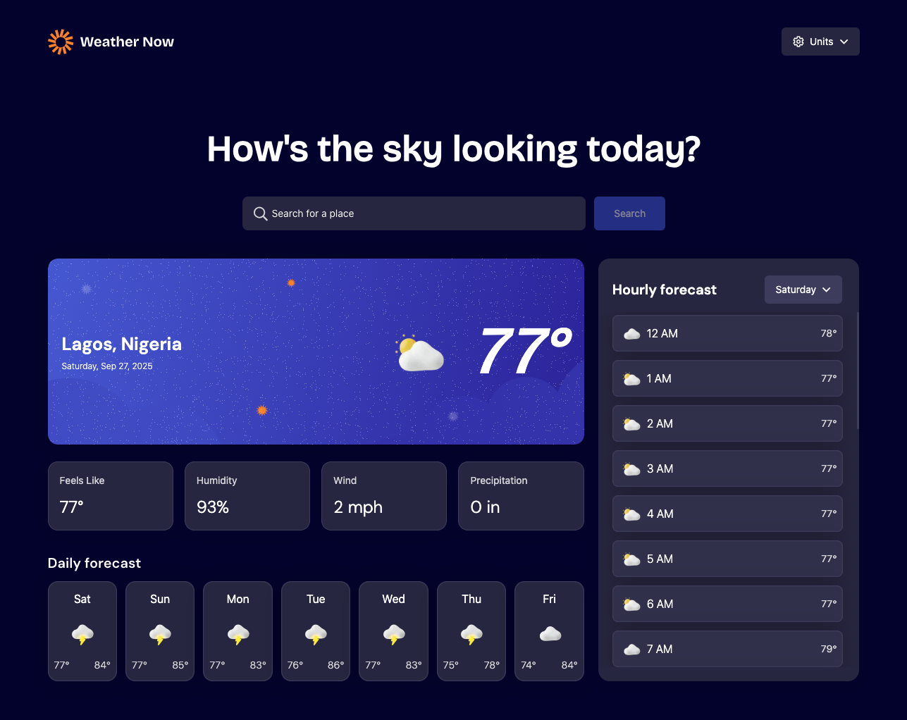

# Frontend Mentor - Weather app solution

This is a solution to the [Weather app challenge on Frontend Mentor](https://www.frontendmentor.io/challenges/weather-app-K1FhddVm49). Frontend Mentor challenges help you improve your coding skills by building realistic projects.

- [Overview](#overview)
  - [The challenge](#the-challenge)
  - [Screenshot](#screenshot)
  - [Links](#links)
- [My process](#my-process)
  - [Built with](#built-with)
  - [What I learned](#what-i-learned)
  - [Continued development](#continued-development)
  - [Useful resources](#useful-resources)
- [Author](#author)
- [Acknowledgments](#acknowledgments)

## Overview

### The challenge

Users should be able to:

- Search for weather information by entering a location in the search bar (with debounce to prevent excessive API calls)
- View current weather conditions including temperature, weather icon, and location details
- See additional metrics like feels-like temperature, humidity, wind speed, and precipitation
- Browse a 7-day forecast with daily highs/lows and icons
- View an hourly forecast with temperature changes throughout the day
- Switch between days using the hourly forecast selector
- Toggle between Celsius/Fahrenheit and metric/imperial units
- Experience a responsive design that adapts to all screen sizes
- See skeleton loaders while data is loading and error UI when API fails

### Screenshot



### Links

- Solution URL: [Add solution URL here](https://your-solution-url.com)
- Live Site URL: [Live Url](https://frontend-mentor-challenge-two-sepia.vercel.app/)

## My process

### Built with

- [Next.js](https://nextjs.org/) – React framework
- [HeroUI](https://heroui.dev/) – UI components
- [Tailwind CSS](https://tailwindcss.com/) – styling
- [BigDataCloud API](https://www.bigdatacloud.com/) – reverse geolocation
- [Open-Meteo](https://api.open-meteo.com) – weather data
- [Jest](https://jestjs.io/) – testing framework
- [React Testing Library](https://testing-library.com/docs/react-testing-library/intro/) – testing utilities for React

### What I learned

- Integrating **reverse geolocation APIs** (BigDataCloud) to auto-detect user location
- Using **debounce** to optimize search functionality and reduce API calls
- Handling multiple states: loading, success, error, and empty results
- Implementing **skeleton loaders** for better UX during API fetch
- Managing global app state with Context API + custom hooks

Example:

```ts
// Debounced search input
function debounce<T extends (...args: any[]) => void>(
  fn: T,
  delay: number
): (...args: Parameters<T>) => void {
  let timer: ReturnType<typeof setTimeout>;

  return (...args: Parameters<T>) => {
    if (timer) {
      clearTimeout(timer);
    }
    timer = setTimeout(() => {
      fn(...args);
    }, delay);
  };
}
```

### Continued development

- Add **dark mode** and offline caching of recent searches
- Improve **keyboard accessibility** for dropdowns and selectors
- Prefetch **next-day forecast data** for smoother navigation

### Useful resources

- [TanStack Query Docs](https://tanstack.com/query/latest) – caching, prefetching, error handling
- [HeroUI](https://heroui.dev/) – UI components used throughout
- [BigDataCloud Reverse Geocoding](https://www.bigdatacloud.com/) – location detection
- [OpenWeather API](https://openweathermap.org/) – weather data source
- [React Testing Library Docs](https://testing-library.com/docs/) – best practices for testing UI

---

## Testing

I uses **Jest**, **React Testing Library**, and **TanStack Query testing utilities**.
